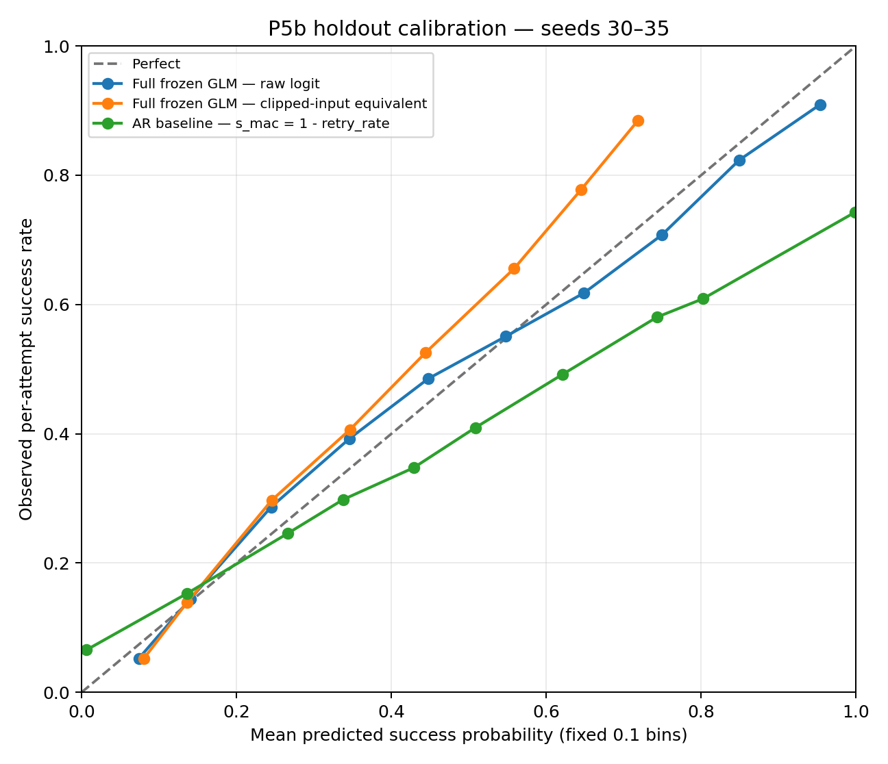
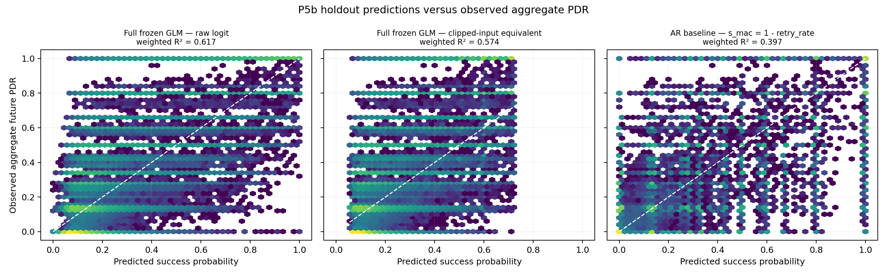
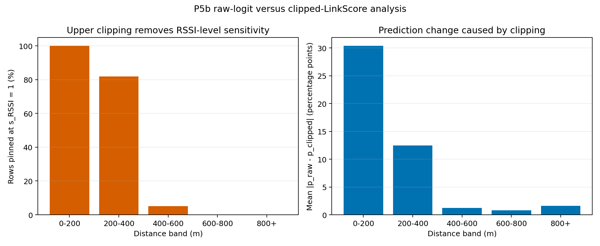

# P5b — đánh giá dự đoán trên holdout

**Ngày:** 2026-07-27  
**Phạm vi:** chỉ holdout đã đóng băng, seeds 30–35. Không refit, không
hiệu chuẩn lại, không đọc `data/eval/`, không sửa kết quả P5a.

## 1. Experimental protocol

Ba đầu vào duy nhất ngoài holdout là:

| Artifact đóng băng | SHA-256 |
|---|---|
| `frozen/split.json` | `ac70dabb866bb9b1cec0d4a46a9af0a9d4c7134a847e58049ab7fc30291bb0d5` |
| `frozen/weights.json` | `d4218c8482cf8cc5375adb59216568e9eb8708bdf85caa1b93220dad5fd2275b` |
| `frozen/normalization.json` | `ff3bc97ee9cab084c1b9b17c9464a38fb57712f4dbcb5e7583cf9e0a8f790733` |

Full model dùng nguyên công thức deployment đã đóng băng:

\[
z=29.0522585+0.3347219\,RSSI+0.7195914\,slope
  -1.8516755\,retry,\qquad \hat p=\operatorname{logistic}(z).
\]

AR baseline dùng implementation đã tồn tại trong normalization:
\(\hat p_{AR}=s_{mac}=1-\operatorname{clip}(retry,0,1)\). Không có tham số
nào được ước lượng trên holdout.

So sánh clipped giữ nguyên cả weights lẫn normalization. Các feature được
clip bằng cặp p20/p80 đóng băng, sau đó đưa lại vào chính Full GLM. Dạng này
tương đương đại số với LinkScore:

\[
z_{clip}=-2.7335087+3.6792329\,LinkScore.
\]

Sai số tương đương số học lớn nhất là \(6.0\times10^{-15}\). LinkScore
[0,1] bản thân là điểm xếp hạng, không phải xác suất; vì vậy LogLoss,
Brier và calibration dùng \(\operatorname{logistic}(z_{clip})\), không
tuỳ tiện coi LinkScore là xác suất.

Nhãn vẫn là per-attempt:
`successes = trials_future - fails_future`. LogLoss và Brier được tính
chính xác từ hai số đếm binomial; ROC AUC và PR AUC dùng successes/failures
làm trọng số, không bung dòng và không dùng post-ARQ PDR. Reliability dùng
10 bin xác suất cố định, rộng 0,1. Không chọn hoặc tối ưu confusion
threshold nào trên holdout.

Evaluator tái lập nằm tại `analysis/validate/p5b_eval.py`; point metrics
và provenance dạng máy đọc nằm tại `reports/P5b-metrics.json`, còn toàn
bộ prediction nằm tại
`data/processed/P5b-holdout-predictions.csv.gz`.

## 2. Holdout integrity

Assert từ `frozen/split.json`:

- fit = seeds 6–29;
- holdout = seeds 30–35;
- giao hai tập = rỗng;
- các seed thật sự quan sát trong dữ liệu = đúng `{30,31,32,33,34,35}`.

| Seed | Số dòng |
|---:|---:|
| 30 | 22.625 |
| 31 | 20.859 |
| 32 | 21.126 |
| 33 | 21.784 |
| 34 | 19.740 |
| 35 | 22.927 |
| **Tổng** | **129.061** |

Trong đó 128.237 dòng có đủ `retry_rate` để chạy Full/AR; 824 dòng
(0,638%) thiếu retry. File prediction vẫn giữ đủ 129.061 dòng và đánh dấu
824 prediction không xác định thay vì impute hoặc loại âm thầm. Metrics
được tính trên 128.237 dòng đủ feature, tương ứng 959.647 future attempts:
243.015 thành công và 716.632 thất bại. Prevalence thành công là 25,32%;
tỉ lệ lớp đa số/thiểu số là 2,95:1, nên PR AUC được báo cáo.

## 3. Baseline comparison

### Baseline có implementation đóng băng

| Model | LogLoss ↓ | Brier ↓ | ROC AUC ↑ | PR AUC/AP ↑ | Weighted R² ↑ | ECE-10 ↓ |
|---|---:|---:|---:|---:|---:|---:|
| **Full: RSSI + slope + retry, raw logit** | **0,420494** | **0,132486** | **0,830396** | **0,666080** | **0,617227** | **0,021919** |
| AR: `1 - retry_rate` | 1,807126 | 0,152691 | 0,803451 | 0,576340 | 0,396973 | 0,077270 |

Trên các point estimate holdout, Full tốt hơn AR ở cả discrimination,
proper scoring rules và calibration. Chênh lệch Full so với AR là
−1,386632 LogLoss, −0,020205 Brier, +0,026945 ROC AUC và +0,089739 PR
AUC. Đây là so sánh predictive performance; chưa có khoảng tin cậy theo
seed nên không diễn giải các chênh lệch này như một kiểm định ý nghĩa.
R² ở đây là R² giữa prediction và aggregate `pdr_future`, có trọng số bằng
`trials_future`; nó không thay thế per-attempt Brier score.

LogLoss của AR đặc biệt lớn vì đây là persistence score có thể cho xác
suất đúng bằng 0 hoặc 1: 41,05% attempts nằm ở một endpoint. Chỉ phép
tính LogLoss dùng clip số học \([10^{-15},1-10^{-15}]\); Brier và các
ranking metric dùng score nguyên trạng.

### Baseline đã đăng ký nhưng không có frozen implementation

| Baseline | Trạng thái P5b | Lý do |
|---|---|---|
| RSSI only | Không đánh giá | Repo không có coefficients/inference implementation đóng băng. |
| RSSI + slope | Không đánh giá | Repo không có coefficients/inference implementation đóng băng. Bỏ retry khỏi conditional Full model không tái tạo reduced model đã đăng ký. |
| LET | Không đánh giá | Không tìm thấy implementation LET trong repo. |

Không tạo surrogate và không refit các hàng này, đúng ràng buộc P5b.
Do đó dữ liệu hiện tại **không cho phép kết luận** Full thắng RSSI-only,
RSSI+slope hoặc LET.

## 4. Calibration

| Model | Mean prediction | Observed prevalence | ECE-10 |
|---|---:|---:|---:|
| Full raw | 0,253283 | 0,253234 | 0,021919 |
| Full clipped | 0,229429 | 0,253234 | 0,040041 |
| AR | 0,280201 | 0,253234 | 0,077270 |

Full raw gần khớp prevalence khi gộp toàn holdout, nhưng reliability curve
vẫn cho thấy sai lệch cục bộ: underprediction ở các bin 0,2–0,5 và
overprediction ở các bin cao. Vì thế không nên suy từ mean calibration
gần bằng 0 sang “calibrated hoàn hảo”.

Bảng reliability đầy đủ cho cả ba score nằm tại
`reports/P5b-reliability.csv`; mỗi hàng có số dòng, số attempts, số
successes, mean prediction, observed success rate và calibration gap.

Holdout scatter cho cùng ba score:

## 5. Raw-vs-Clip analysis

### Toàn holdout

| Variant của Full frozen model | LogLoss ↓ | Brier ↓ | ROC AUC ↑ | PR AUC/AP ↑ | Weighted R² ↑ | ECE-10 ↓ |
|---|---:|---:|---:|---:|---:|---:|
| **Raw logit** | **0,420494** | **0,132486** | **0,830396** | **0,666080** | **0,617227** | **0,021919** |
| Clipped-input equivalent | 0,429713 | 0,136479 | 0,829628 | 0,650273 | 0,573701 | 0,040041 |

Clipping làm LogLoss tăng 0,009219, Brier tăng 0,003993, PR AUC giảm
0,015807 và ECE tăng 0,018121. Mean absolute change của xác suất là 4,181
điểm phần trăm; cực đại 88,91 điểm phần trăm. ROC AUC chỉ giảm 0,000767:
clipping giữ khá nhiều thứ hạng tổng thể nhưng làm mất thông tin biên độ
và calibration rõ hơn.

### Sensitivity theo khoảng cách

| Khoảng cách | `s_RSSI=1` | Mean \(|p_{raw}-p_{clip}|\) | LogLoss raw | LogLoss clip | Brier raw | Brier clip |
|---|---:|---:|---:|---:|---:|---:|
| 0–200 m | **100,00%** | **30,395 pp** | **0,343899** | 0,471571 | **0,082046** | 0,144093 |
| 200–400 m | 81,92% | 12,481 pp | **0,600431** | 0,641601 | **0,207098** | 0,224919 |
| 400–600 m | 5,06% | 1,254 pp | **0,622851** | 0,625441 | **0,213872** | 0,215003 |
| 600–800 m | 0,00% | 0,824 pp | 0,285360 | **0,283864** | 0,075713 | **0,075133** |
| ≥800 m | 0,00% | 1,591 pp | **0,109094** | 0,109684 | 0,016314 | **0,015012** |

Trong 0–200 m, toàn bộ 4.564 dòng bị ghim tại `s_RSSI=1`. Vì vậy:

- raw logit còn \(\partial z/\partial RSSI=0.334722\) log-odds/dB;
- clipped RSSI channel có đạo hàm bằng 0 trên đúng 100% dòng;
- đóng góp RSSI-level raw có SD 1,240 log-odds và range 10,707;
- đóng góp RSSI-level clipped có SD số học xấp xỉ 0 và range đúng 0.

Kết luận chính xác ở đây là **RSSI-level channel** mất hoàn toàn
sensitivity trong vùng 0–200 m; toàn LinkScore vẫn có thể đổi qua slope
và MAC-retry. Số liệu vẫn ủng hộ quyết định để controller P8 chạy trên
raw logit: clipped score xoá đạo hàm RSSI đúng ở vùng gần, đồng
thời trong holdout làm mean prediction vùng này giảm từ 0,9646 xuống
0,6541 dù observed success là 0,9116.

Clipped không thua raw trong mọi distance band: ở 600–800 m nó có
LogLoss/Brier thấp hơn nhẹ, và ở ≥800 m Brier thấp hơn nhẹ. Vì vậy kết
quả chỉ hỗ trợ raw theo hiệu năng tổng thể và yêu cầu giữ sensitivity
vùng gần, không chứng minh raw pointwise ưu thế ở mọi miền.

## 6. Discussion

P5b cung cấp hai kết quả holdout không cần quay lại beta:

1. Full frozen raw GLM vượt AR persistence baseline trên mọi metric được
   báo cáo. Điều này cho thấy feature vật lý cùng retry history có giá trị
   dự đoán ngoài việc chép lại retry rate quá khứ trên holdout này.
2. Clipping hầu như giữ ROC ranking tổng thể nhưng làm xấu proper scores,
   PR ranking và calibration, đặc biệt xoá hoàn toàn RSSI-level
   sensitivity trong 0–200 m. Đây là bằng chứng trực tiếp cho lựa chọn
   implementation P8 dùng raw logit thay vì lấy clipped LinkScore làm
   trạng thái động.

Hai kết quả trên không thay đổi bất kỳ kết luận nào của P5a và không được
diễn giải thành phân tích lại coefficients.

## 7. Limitations

- Bảng baseline preregistered chưa đầy đủ: không có frozen implementation
  cho RSSI-only, RSSI+slope và LET. Dưới lệnh cấm refit/tạo baseline mới,
  P5b không thể hợp lệ hoá ba hàng này.
- Metrics Full/AR có coverage 99,36% số dòng holdout và điều kiện trên
  việc `retry_rate` quan sát được; 824 dòng thiếu retry không được impute.
- Các attempts trong cùng seed/link/time không độc lập. Báo cáo này đưa
  point metrics predictive, không đưa p-value hay confidence interval
  và không tuyên bố ý nghĩa thống kê của chênh lệch metric.
- Reliability dùng 10 bin cố định; hình dạng đường cong có thể đổi nếu
  dùng binning khác. Không có calibration refit trên holdout.
- LogLoss AR nhạy với quy ước số học tại xác suất 0/1; Brier, ROC AUC và
  PR AUC không chịu quy ước clip LogLoss này.
- So sánh clipped dùng affine logit mapping suy ra đúng từ frozen
  coefficients. Nó đánh giá hậu quả clipping trên prediction; không
  tuyên bố LinkScore [0,1] nguyên bản là xác suất đã hiệu chuẩn.
- Kết quả chỉ áp dụng cho sáu simulation seeds và cấu hình đã đóng băng;
  chưa phải bằng chứng external validity hoặc Tier-C evaluation.
